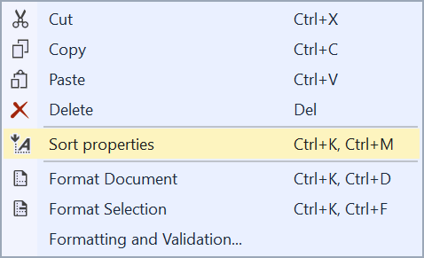
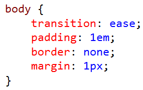
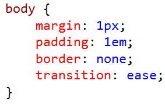

# CSS Sorter

Download this extension from the [Marketplace](https://marketplace.visualstudio.com/items?itemName=MadsKristensen.CSSSorter)
or get the [CI build](http://vsixgallery.com/extension/87534672-5a41-4ea1-a145-17f1a8f5502a/).

---------------------------------------

Sort CSS properties easily for better readibility and GZIP compression

See the [change log](CHANGELOG.md) for changes and road map.

## Features

- Sorts CSS properties
- Uses [CSS Declaration Sorter](https://github.com/ben-eb/css-declaration-sorter) node module under the hood
- How it works

### Sort properties
This extension calls the [CSS Declaration Sorter](https://github.com/ben-eb/css-declaration-sorter) node module behind the scenes to perform the property sorting.

Invoke the command from the context menu in the CSS editor.

#### Example

This input:

Becomes turns into this after sorting with the SMACSS sorting mode:

### How it works
The first time a .css file is opened in Visual Studio after installing this extension, the [css-declaration-sorter](https://github.com/ben-eb/css-declaration-sorter) npm package is being installed into *%LocalAppData%\Temp\CSS Sorter*. It can take up to a minute but usually not more. You have to be online for it to install.

When the npm package has been installed, the context menu button lights up in the CSS editor. When the button is clicked, a process is being started that calls the npm package using Node.js.

So make sure to have Node.js installed or the latest ASP.NET Web Development Tools for Visual Studio which includes Node.js.

## Contribute
Check out the [contribution guidelines](.github/CONTRIBUTING.md)
if you want to contribute to this project.

For cloning and building this project yourself, make sure
to install the
[Extensibility Tools 2015](https://visualstudiogallery.msdn.microsoft.com/ab39a092-1343-46e2-b0f1-6a3f91155aa6)
extension for Visual Studio which enables some features
used by this project.

## License
[Apache 2.0](LICENSE)